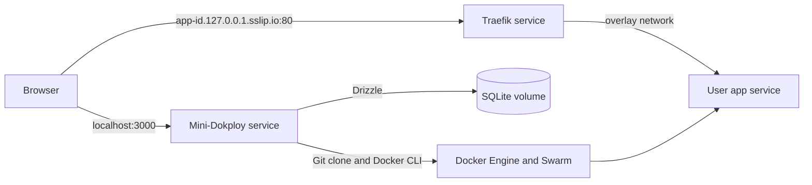

# Mini-Dokploy

Mini-Dokploy builds a public Git repository from a Dockerfile, runs the image as a Docker Swarm service, and makes it available through Traefik at a local `sslip.io` subdomain. It includes email and password accounts, per-user deployment ownership, redeploy and removal actions, and live build logs over WebSockets.

## Prerequisites

- **Required for `up.sh`:** macOS, [Docker Desktop for Mac](https://docs.docker.com/desktop/setup/install/mac-install/) (including its `docker` CLI), internet access to download images and clone public Git repositories, and free ports **80** and **3000** on the first run. The script also uses macOS `open`, [`curl`](https://curl.se/download.html), and [`openssl`](https://www.openssl-library.org/source/). It checks for these commands before changing Docker resources and prints installation guidance if one is missing.
- **Only for development and tests on the host:** [Node.js](https://nodejs.org/en/download) with npm; Node.js 22 matches the project's Docker image and CI. You do **not** need host Node.js or `npm install` to use `up.sh`: the container image installs its own dependencies.

No VPS, DNS record, hosts-file edit, or Docker Compose stack is needed. `up.sh` does not install software automatically; install a missing prerequisite from its official link, then run the command again.

## Start with one command

From the repository root, run:

```sh
sh scripts/up.sh
```

On its first run, the script checks prerequisites, confirms the local `desktop-linux` Docker context, starts Docker Desktop if needed, and waits for its engine. It then initializes a single-node Swarm if needed, creates the shared network, persistent SQLite/logs volume, and auth secret, builds Mini-Dokploy, starts Traefik and the controller, and waits until the panel answers at [http://localhost:3000](http://localhost:3000). The last line should say `Ready: http://localhost:3000`.

Open that URL and create an account. To deploy an app, enter its public HTTPS Git URL, its Dockerfile path relative to the repository root, and the port the app listens on **inside** its container. Custom Docker labels are optional. Once this repository is public, its Git URL with `fixtures/hello-app/Dockerfile` and port `3000` can serve as a demo. Docker uses the repository root as the build context, so the Dockerfile may copy files from elsewhere in that repository.

To pick up local code changes later, run `sh scripts/up.sh` again. It rebuilds and updates the Mini-Dokploy controller without deleting its SQLite/logs volume or the user app services. The script refuses other Docker contexts to avoid modifying a remote engine.

## Useful checks

| Command                                               | What it shows                                                         |
| ----------------------------------------------------- | --------------------------------------------------------------------- |
| `docker context show`                                 | Should be `desktop-linux` before using `up.sh`.                       |
| `docker info --format '{{.Swarm.LocalNodeState}}'`    | Whether the local engine is in Swarm mode.                            |
| `docker service ls`                                   | Traefik, Mini-Dokploy, and deployed app services with replica counts. |
| `docker service logs --tail 100 mini-dokploy-app`     | Recent controller errors and startup logs.                            |
| `docker service logs --tail 100 mini-dokploy-traefik` | Routing and Docker API discovery errors.                              |
| `curl -I http://localhost:3000/`                      | Whether the local panel responds over HTTP.                           |

## Developer scripts

Host-side commands below require Node.js and npm. For a local development server, run `npm ci`, `npm run db:migrate`, then `npm run dev` with `BETTER_AUTH_SECRET` set to a random string of at least 32 characters. Stop the Swarm controller first if it already owns port 3000; this development path is separate from the one-command Docker setup.

| Command                                      | Purpose                                                                                 |
| -------------------------------------------- | --------------------------------------------------------------------------------------- |
| `sh scripts/up.sh`                           | Build and start/update the local Docker Swarm stack; no host Node.js required.          |
| `npm run dev` / `npm run start`              | Run the server locally in development / production mode.                                |
| `npm run build` / `npm run typecheck`        | Build the Next.js app / check TypeScript.                                               |
| `npm test` / `npm run test:coverage`         | Run unit tests / enforce coverage thresholds and write `coverage/`.                     |
| `npm run format` / `npm run format:check`    | Apply / check Prettier formatting.                                                      |
| `npm run db:generate` / `npm run db:migrate` | Generate a Drizzle migration / apply pending migrations.                                |
| `npm run smoke:auth`                         | Check sign-up, sessions, and protected tRPC calls against a running server.             |
| `npm run smoke:deployment`                   | Run the manual Docker integration test; it creates and removes a temporary app service. |

Before submitting code changes, run `npm run format:check`, `npm run typecheck`, `npm run test:coverage`, and `npm run build`. Module tests live in `src/server/tests/` and `src/client/tests/`; they cover input validation, Docker commands, Dockerfile path containment, deployment state transitions, UI behavior, and the startup preflight. CI also runs migrations and the auth smoke test.

## Architecture



Next.js Pages Router serves the UI, Better Auth routes, and tRPC API. The controller uses the Docker CLI through a mounted Docker socket to build images and manage Swarm services. Traefik watches Swarm service labels and forwards HTTP to each app's declared internal port. A Docker volume persists SQLite and build logs.

The tRPC interface exposes `deployments.list`, `deployments.create`, `deployments.redeploy`, and `deployments.remove`. Every procedure requires a Better Auth session and scopes records by user ID. The WebSocket endpoint `/api/logs?id=<deployment-id>` validates the same session, request origin, and ownership before replaying recent output and streaming new lines.

## Tradeoffs

This is deliberately a local, single-node assessment. Built images live on the local Docker engine and are not pushed to a registry. The controller and Traefik have Docker socket access, which is powerful and unsuitable as a production isolation boundary. User-supplied apps do not receive that socket. Only public HTTPS Git repositories are supported; there is no private-repository credential flow. Generated routing labels are controlled by the platform, so custom labels cannot use the `traefik.*` namespace. The demo uses HTTP, not TLS.

Build work runs in the controller process and writes logs to a local volume. A controller restart marks interrupted operations as failed; it does not resume them. Redeploy keeps the prior image when cloning or building fails. Docker service startup is considered ready at one running replica, without an application-level HTTP health check.

## Troubleshooting

| Symptom                                            | What to do                                                                                                                                                                                                                                |
| -------------------------------------------------- | ----------------------------------------------------------------------------------------------------------------------------------------------------------------------------------------------------------------------------------------- |
| `up.sh` reports a missing command                  | Follow the link in its message, install the tool, reopen Terminal if needed, and rerun `sh scripts/up.sh`. Host Node.js is not required for this script.                                                                                  |
| Docker Desktop is missing or does not become ready | Install or open [Docker Desktop for Mac](https://docs.docker.com/desktop/setup/install/mac-install/), finish its first-run prompts, then check `docker info` and rerun the script. The script waits up to three minutes after opening it. |
| The Docker context is not `desktop-linux`          | Run `docker context use desktop-linux`, then rerun `sh scripts/up.sh`. The script will not target a remote engine.                                                                                                                        |
| Port 80 or 3000 cannot be published                | On the first run, inspect listeners with `lsof -nP -iTCP:80 -sTCP:LISTEN` and `lsof -nP -iTCP:3000 -sTCP:LISTEN`; stop the conflicting program before retrying. Existing Mini-Dokploy services may already own these ports on later runs. |
| Image download, Git clone, or build fails          | Confirm internet access and read `docker service logs --tail 100 mini-dokploy-app` or the deployment's live logs for the exact error.                                                                                                     |
| `localhost:3000` never becomes ready               | Run `docker service ls` and `docker service logs --tail 100 mini-dokploy-app`; confirm its task reaches `1/1` and port 3000 is free of unrelated processes.                                                                               |
| A deployed app returns **404**                     | Read `docker service logs --tail 100 mini-dokploy-traefik`. Traefik needs Docker API access to discover Swarm labels. A brief 404 after a task reaches `1/1` can occur during discovery.                                                  |
| A deployed app returns **502 Bad Gateway**         | The route exists, but the app is not answering on the internal port entered in the form. Check its logs, listening port, and bind address (`0.0.0.0`).                                                                                    |
| The browser says **“Not secure”**                  | Expected: the generated `sslip.io` URL uses `http://`. This local assessment does not configure HTTPS certificates.                                                                                                                       |

The startup script pins Traefik v3.7.13 because the older v3.4 image cannot discover Swarm services on Docker Engine 29. HTTPS would require a trusted certificate and a suitable public domain, outside this local assessment.

## Next steps

These are possible features for a future iteration, not capabilities of the current build:

- **Deploy a selected Git branch:** Let users choose a branch when creating a deployment, while keeping the repository's default branch as the fallback.
- **Show the deployed commit:** Record and display the commit SHA used for each successful deployment so its exact source revision is visible.
- **Download deployment logs:** Offer an authenticated download of the logs already stored for a deployment, in addition to the live log view.

## AI tool usage

AI was used throughout this assessment as a development aid, with a shift-left mindset: clarify requirements, risks, and expected behavior early, then review generated work before relying on it.

- **Implementation:** AI helped generate and refine code and documentation. Its output was treated as a draft to inspect, test, and adjust rather than as an automatically correct solution.
- **Research and decisions:** AI supported brainstorming, learning unfamiliar technologies such as Traefik and `sslip.io`, and comparing alternative approaches to the home test. The final choices were made against the assessment requirements and the behavior observed locally.
- **Testing and review:** AI helped define the testing scope. Multiple agents were used as checkpoints for code review, verification, builds, and deciding when the implementation was ready to submit.

Verification was performed on the project itself through type checking, automated tests and coverage, production builds, database migrations, authentication checks, and Docker deployment checks. AI assistance did not replace those checks or ownership of the final result.
