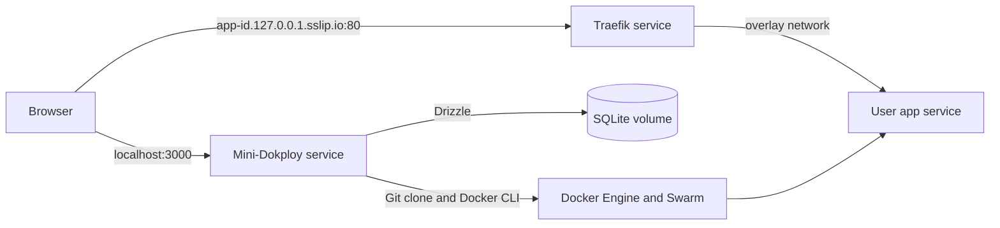

# Mini-Dokploy

Mini-Dokploy builds a public Git repository from a Dockerfile, runs the image as a Docker Swarm service, and makes it available through Traefik at a local `sslip.io` subdomain. It includes email and password accounts, per-user deployment ownership, redeploy and removal actions, and live build logs over WebSockets.

## Run locally

Prerequisites: macOS with Docker Desktop installed, internet access for images and public Git repositories, and free ports 80 and 3000. The startup script uses `docker`, `open`, `openssl`, and `curl`. No VPS, DNS record, hosts-file edit, or Compose stack is needed.

```sh
sh scripts/up.sh
```

The script starts Docker Desktop if needed, initializes a single-node Swarm if needed, creates the network, volume, and auth secret, then creates or updates the Traefik and Mini-Dokploy services. It waits for the UI at [http://localhost:3000](http://localhost:3000). Running the same command again rebuilds and updates Mini-Dokploy without deleting the SQLite volume. It refuses non-`desktop-linux` Docker contexts to avoid modifying a remote engine.

Create an account, then enter a public HTTPS Git URL, a Dockerfile path relative to that repository's root, and the port on which the app listens inside its container. Once this repository is public, it can serve as a demo: use its Git URL, `fixtures/hello-app/Dockerfile`, and port `3000`. Docker's build context is the repository root, so the Dockerfile can copy files from elsewhere in that repository.

Useful checks:

```sh
docker service ls
docker service logs mini-dokploy-app
docker service logs mini-dokploy-traefik
```

For local code changes, run `npm install`, `npm run db:migrate`, and `npm run dev` with `BETTER_AUTH_SECRET` set to a random string of at least 32 characters. Stop the Swarm app service first if it already owns port 3000. Run `npm run typecheck`, `npm run test:coverage`, `npm run build`, and `npm run format:check` before submitting. `npm run format` applies Prettier to code and documentation.

The test suite covers input validation, Docker command construction, Dockerfile path containment, and deployment state transitions. `npm run test:coverage` enforces minimum coverage for these core modules and writes an HTML report to `coverage/`. `npm run smoke:auth` verifies real sign-up, sessions, and protected tRPC calls against a running server. `npm run smoke:deployment` is a manual Docker integration test that creates a temporary service from Docker's public example repository, checks tenant isolation, WebSocket logs, routing, and redeploy, then removes the service. CI runs formatting, type checking, unit coverage, migrations, build, and the auth smoke test.

## Architecture



Next.js Pages Router serves the UI, Better Auth routes, and tRPC API. The controller uses the Docker CLI through a mounted Docker socket to build images and manage Swarm services. Traefik watches Swarm service labels and forwards HTTP to each app's declared internal port. A Docker volume persists SQLite and build logs. See the [Spanish architecture guide](docs/arquitectura.md), [learning guide](docs/guia-de-aprendizaje.md), and [glossary](docs/glosario.md) for diagrams and a walkthrough.

The tRPC interface exposes `deployments.list`, `deployments.create`, `deployments.redeploy`, and `deployments.remove`. Every procedure requires a Better Auth session and scopes records by user ID. The WebSocket endpoint `/api/logs?id=<deployment-id>` validates the same session, request origin, and ownership before replaying recent output and streaming new lines.

## Tradeoffs

This is deliberately a local, single-node assessment. Built images live on the local Docker engine and are not pushed to a registry. The controller and Traefik have Docker socket access, which is powerful and unsuitable as a production isolation boundary. User-supplied apps do not receive that socket. Only public HTTPS Git repositories are supported; there is no private-repository credential flow. Generated routing labels are controlled by the platform, so custom labels cannot use the `traefik.*` namespace. The demo uses HTTP, not TLS.

Build work runs in the controller process and writes logs to a local volume. A controller restart marks interrupted operations as failed; it does not resume them. Redeploy keeps the prior image when cloning or building fails. Docker service startup is considered ready at one running replica, without an application-level HTTP health check.

## Troubleshooting

If a deployed URL returns **404**, check `docker service logs mini-dokploy-traefik`: Traefik must be able to read the Docker API. The startup script pins Traefik v3.7.13 because the older v3.4 image cannot discover Swarm services on Docker Engine 29. A brief 404 just after a task reaches `1/1` is possible while Traefik discovers its labels. A persistent **502** means the route exists but the app does not answer on the port entered in the form; check the Dockerfile's listening port and bind address (`0.0.0.0`). The generated `sslip.io` URL is intentionally `http://`; the browser's “Not secure” indicator is expected. HTTPS would require a trusted certificate and a suitable public domain, outside this local assessment.

## Next steps

These are possible features for a future iteration, not capabilities of the current build:

- **Deploy a selected Git branch:** Let users choose a branch when creating a deployment, while keeping the repository's default branch as the fallback.
- **Show the deployed commit:** Record and display the commit SHA used for each successful deployment so its exact source revision is visible.
- **Download deployment logs:** Offer an authenticated download of the logs already stored for a deployment, in addition to the live log view.

## AI tool usage

AI was used throughout this assessment as a development aid, with a shift-left mindset: clarify requirements, risks, and expected behavior early, then review generated work before relying on it.

- **Implementation:** AI helped generate and refine code and documentation. Its output was treated as a draft to inspect, test, and adjust rather than as an automatically correct solution.
- **Research and decisions:** AI supported brainstorming, learning unfamiliar technologies such as Traefik and `sslip.io`, and comparing alternative approaches to the home test. The final choices were made against the assessment requirements and the behavior observed locally.
- **Testing and review:** AI helped define the testing scope. Multiple agents were used as checkpoints for code review, verification, builds, and deciding when the implementation was ready to submit.

Verification was performed on the project itself through type checking, automated tests and coverage, production builds, database migrations, authentication checks, and Docker deployment checks. AI assistance did not replace those checks or ownership of the final result.
